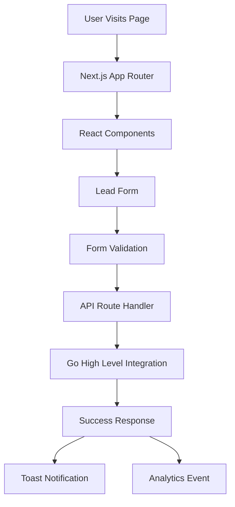

# PLANNING.md - Enlightened Informatics Landing Page

## 1. Vision Statement

### Product Vision
Build a high-converting, modern landing page that showcases Enlightened Informatics' expertise in AI, automation, and data-driven business transformation. The page will embody Timi Abiola's conversational yet authoritative brand voice while delivering a seamless user experience that converts visitors into qualified leads.

### Key Differentiators
- **Conversational Authority**: Blend technical expertise with approachable, empathetic messaging
- **Implementation Focus**: Emphasize hands-on solutions, not just consulting
- **Data-Driven Results**: Highlight concrete 25% revenue growth promise
- **Modern Tech Stack**: Leverage cutting-edge React, TypeScript, and AI-ready architecture

### Success Metrics
- 5%+ conversion rate on lead form
- <3 second page load time
- 90+ Lighthouse performance score
- 70%+ qualified lead rate

## 2. Technical Architecture

### 2.1 Component Architecture
```
src/
├── components/
│   ├── layout/
│   │   ├── Header.tsx
│   │   ├── Footer.tsx
│   │   └── Section.tsx
│   ├── hero/
│   │   ├── HeroSection.tsx
│   │   ├── HeroImage.tsx
│   │   └── AnimatedBackground.tsx
│   ├── features/
│   │   ├── ThreePillars.tsx
│   │   ├── PillarCard.tsx
│   │   └── ProcessTimeline.tsx
│   ├── forms/
│   │   ├── LeadCaptureForm.tsx
│   │   ├── FormField.tsx
│   │   └── FormValidation.tsx
│   ├── social-proof/
│   │   ├── Testimonials.tsx
│   │   └── ClientLogos.tsx
│   └── ui/              # shadcn/ui components
│       ├── button.tsx
│       ├── card.tsx
│       ├── input.tsx
│       ├── textarea.tsx
│       ├── radio-group.tsx
│       └── ...
├── lib/
│   ├── utils.ts
│   ├── api.ts
│   ├── constants.ts
│   └── hooks/
│       ├── useFormSubmission.ts
│       └── useScrollAnimation.ts
├── styles/
│   ├── globals.css
│   └── components/
├── types/
│   └── index.ts
└── app/
    ├── layout.tsx
    └── page.tsx
```

### 2.2 Data Flow Architecture


### 2.3 State Management
- **Form State**: React Hook Form for form management
- **UI State**: Local component state with useState
- **Toast State**: Sonner for notifications
- **Scroll State**: Custom hooks for animations

### 2.4 Performance Architecture
- **Code Splitting**: Dynamic imports for below-fold content
- **Image Optimization**: Next.js Image component with WebP
- **CSS**: Tailwind JIT compilation
- **Fonts**: Variable fonts with font-display: swap
- **Bundle Size**: Tree-shaking with proper imports

## 3. Technology Stack

### 3.1 Core Technologies

#### Frontend Framework
- **React 18.3+**: Latest stable with concurrent features
- **TypeScript 5.3+**: Type safety and better DX
- **Next.js 14+**: App Router, Server Components, API Routes

#### Styling
- **Tailwind CSS 3.4+**: Utility-first with JIT mode
- **shadcn/ui v4**: Pre-built accessible components
- **Framer Motion**: Smooth animations and interactions

#### Form Handling
- **React Hook Form**: Performant form state management
- **Zod**: Schema validation for TypeScript
- **Sonner**: Toast notifications

#### Development Tools
- **Cursor + Claude Code**: AI-powered development
- **ESLint + Prettier**: Code quality and formatting
- **Husky**: Git hooks for quality checks

### 3.2 Infrastructure

#### Deployment
- **Vercel**: Optimized Next.js hosting
- **Edge Functions**: API route optimization
- **CDN**: Global asset delivery

#### Analytics & Monitoring
- **Google Analytics 4**: User behavior tracking
- **Vercel Analytics**: Core Web Vitals
- **Sentry**: Error tracking

#### Integrations
- **Go High Level**: CRM/Lead management
- **Facebook Pixel**: Ad conversion tracking
- **Google Tag Manager**: Tag management

## 4. Component Implementation Guide

### 4.1 Core shadcn/ui Components

#### Button Component (CTA)
```tsx
// Custom variant for brand colors
const buttonVariants = cva(
  "base-styles...",
  {
    variants: {
      variant: {
        primary: "bg-[#00F0FF] text-[#0B3142] hover:bg-[#FF2C6D] transition-all duration-300",
        secondary: "bg-[#FF2C6D] text-white hover:bg-[#00F0FF] hover:text-[#0B3142]",
      }
    }
  }
)
```

#### Card Component (Three Pillars)
```tsx
// Enhanced card with gradient borders
<Card className="relative overflow-hidden bg-[#0B3142] border-0">
  <div className="absolute inset-0 bg-gradient-to-r from-[#00F0FF] to-[#FF2C6D] opacity-20" />
  <CardHeader>
    <CardTitle className="text-[#FFF6D6]">Title</CardTitle>
  </CardHeader>
  <CardContent>
    {/* Content */}
  </CardContent>
</Card>
```

#### Form Components
```tsx
// Lead capture form structure
<form onSubmit={handleSubmit}>
  <div className="space-y-6">
    {/* Phone Input */}
    <div className="space-y-2">
      <Label htmlFor="phone">Your Best Phone Number*</Label>
      <Input 
        id="phone" 
        type="tel" 
        className="bg-[#0B3142]/50 border-[#3EC6FF]/30 focus:border-[#00F0FF]"
      />
    </div>
    
    {/* Industry Input */}
    <div className="space-y-2">
      <Label htmlFor="industry">Your Industry*</Label>
      <Input 
        id="industry" 
        className="bg-[#0B3142]/50 border-[#3EC6FF]/30 focus:border-[#00F0FF]"
      />
    </div>
    
    {/* Process Textarea */}
    <div className="space-y-2">
      <Label htmlFor="process">What's Eating Up Your Team's Time?*</Label>
      <Textarea 
        id="process" 
        className="bg-[#0B3142]/50 border-[#3EC6FF]/30 focus:border-[#00F0FF] min-h-[120px]"
      />
    </div>
    
    {/* Radio Group */}
    <RadioGroup>
      <div className="flex items-center space-x-2">
        <RadioGroupItem value="yes" id="yes" />
        <Label htmlFor="yes">Yes, I can make financial decisions</Label>
      </div>
      {/* More options */}
    </RadioGroup>
    
    <Button type="submit" className="w-full" variant="primary">
      Get My Free Growth Analysis →
    </Button>
  </div>
</form>
```

### 4.2 Custom Components

#### Hero Section
```tsx
const HeroSection = () => {
  return (
    <section className="relative min-h-screen flex items-center">
      {/* Animated gradient background */}
      <div className="absolute inset-0 bg-gradient-to-br from-[#2B174C] to-[#0B3142]">
        <AnimatedNeuralNetwork />
      </div>
      
      {/* Content */}
      <div className="relative z-10 container mx-auto px-6">
        <div className="grid lg:grid-cols-2 gap-12 items-center">
          {/* Text content */}
          <motion.div
            initial={{ opacity: 0, x: -20 }}
            animate={{ opacity: 1, x: 0 }}
            transition={{ duration: 0.6 }}
          >
            <h1 className="text-4xl lg:text-6xl font-bold text-[#FFF6D6] mb-6">
              Ready to Transform Your Business with AI & Data?
            </h1>
            <p className="text-xl text-white/90 mb-8">
              I'll show you exactly how to break through growth barriers...
            </p>
            <Button size="lg" variant="primary">
              Yes, Show Me How →
            </Button>
          </motion.div>
          
          {/* Image */}
          <motion.div
            initial={{ opacity: 0, scale: 0.9 }}
            animate={{ opacity: 1, scale: 1 }}
            transition={{ duration: 0.6, delay: 0.2 }}
          >
            <Image src="/timi-hero.png" alt="Timi Abiola" />
          </motion.div>
        </div>
      </div>
    </section>
  )
}
```

## 5. Development Workflow

### 5.1 AI-Powered Development with Cursor

#### Setup
1. Initialize project with Cursor
2. Configure Claude Code assistant
3. Set up component templates
4. Enable AI autocompletions

#### Best Practices
- Use clear component naming conventions
- Write descriptive comments for AI context
- Leverage shadcn/ui component patterns
- Test components in isolation

### 5.2 Component Development Flow
```
1. Design → shadcn/ui base component
2. Customize → Brand colors and styles
3. Enhance → Animations and interactions
4. Test → Responsive and accessibility
5. Optimize → Performance and bundle size
```

### 5.3 Git Workflow
```bash
main
├── develop
│   ├── feature/hero-section
│   ├── feature/lead-form
│   └── feature/three-pillars
└── staging
```

## 6. Tool Requirements

### 6.1 Development Environment

#### Required Software
- **Node.js**: v20.x LTS
- **pnpm**: v8.x (preferred) or npm
- **Git**: v2.40+
- **Cursor IDE**: Latest version

#### VS Code/Cursor Extensions
- TypeScript + ESLint
- Tailwind CSS IntelliSense
- Prettier
- React snippets
- shadcn/ui snippets

### 6.2 Project Dependencies

#### Core Dependencies
```json
{
  "dependencies": {
    "react": "^18.3.0",
    "react-dom": "^18.3.0",
    "next": "^14.2.0",
    "typescript": "^5.3.0",
    "@radix-ui/react-slot": "^1.0.2",
    "@radix-ui/react-radio-group": "^1.1.3",
    "class-variance-authority": "^0.7.0",
    "clsx": "^2.1.0",
    "tailwind-merge": "^2.2.0",
    "framer-motion": "^11.0.0",
    "react-hook-form": "^7.50.0",
    "@hookform/resolvers": "^3.3.0",
    "zod": "^3.22.0",
    "sonner": "^1.4.0",
    "lucide-react": "^0.350.0"
  }
}
```

#### Development Dependencies
```json
{
  "devDependencies": {
    "@types/react": "^18.3.0",
    "@types/node": "^20.11.0",
    "tailwindcss": "^3.4.0",
    "autoprefixer": "^10.4.0",
    "postcss": "^8.4.0",
    "eslint": "^8.57.0",
    "eslint-config-next": "^14.2.0",
    "prettier": "^3.2.0",
    "prettier-plugin-tailwindcss": "^0.5.0",
    "@testing-library/react": "^14.2.0",
    "jest": "^29.7.0",
    "husky": "^9.0.0"
  }
}
```

### 6.3 External Services

#### Required Accounts
- **Vercel**: Deployment platform
- **Go High Level**: CRM integration
- **Google Analytics**: Analytics
- **Facebook Business**: Pixel tracking

#### API Keys & Environment Variables
```env
# .env.local
NEXT_PUBLIC_GA_ID=G-XXXXXXXXXX
NEXT_PUBLIC_FB_PIXEL_ID=XXXXXXXXXXXXXXX
GHL_WEBHOOK_URL=https://api.gohighlevel.com/v1/...
GHL_API_KEY=your-api-key
SENTRY_DSN=https://...@sentry.io/...
```

## 7. Performance Optimization

### 7.1 Core Web Vitals Targets
- **LCP**: < 2.5s
- **FID**: < 100ms
- **CLS**: < 0.1

### 7.2 Optimization Strategies
- **Images**: WebP format, lazy loading, responsive sizes
- **Fonts**: Variable fonts, preload critical fonts
- **CSS**: Critical CSS inline, purge unused styles
- **JS**: Code splitting, tree shaking, dynamic imports
- **Caching**: Aggressive caching headers, service worker

### 7.3 Monitoring
- Vercel Analytics dashboard
- Google PageSpeed Insights
- Chrome DevTools Performance tab
- Real User Monitoring (RUM)

## 8. Security Considerations

### 8.1 Form Security
- Input sanitization
- Rate limiting on API routes
- CSRF protection
- Honeypot fields for bot prevention

### 8.2 API Security
- Environment variable management
- API key rotation
- Request validation
- Error message sanitization

### 8.3 Content Security Policy
```tsx
// next.config.js
const securityHeaders = [
  {
    key: 'Content-Security-Policy',
    value: `
      default-src 'self';
      script-src 'self' 'unsafe-eval' 'unsafe-inline' *.google-analytics.com;
      style-src 'self' 'unsafe-inline';
      img-src 'self' blob: data: *.google-analytics.com;
      connect-src 'self' *.google-analytics.com *.gohighlevel.com;
    `.replace(/\s{2,}/g, ' ').trim()
  }
]
```

## 9. Launch Checklist

### Pre-Launch
- [ ] All components tested on mobile devices
- [ ] Forms submit successfully to GHL
- [ ] Analytics tracking verified
- [ ] SEO meta tags implemented
- [ ] Performance audit passed
- [ ] Accessibility audit passed
- [ ] Legal pages linked
- [ ] SSL certificate active

### Launch Day
- [ ] Deploy to production
- [ ] Verify all integrations
- [ ] Monitor error logs
- [ ] Test form submissions
- [ ] Check analytics data flow

### Post-Launch
- [ ] Monitor conversion rates
- [ ] A/B test variations
- [ ] Gather user feedback
- [ ] Iterate on messaging
- [ ] Optimize based on data

## 10. Future Enhancements

### Phase 2 Features
- Interactive ROI calculator
- Client portal login
- Blog/Resource section
- Case study pages
- Video testimonials

### Technical Improvements
- Progressive Web App
- Internationalization
- Dark/light theme toggle
- Advanced animations
- AI chatbot integration

---

**Document Version**: 1.0  
**Last Updated**: 2025-08-03  
**Status**: Ready for Development